# <div align="center">Neuro-Art 🎨<div>

<p align="center">
  
</p>

<p align="center">
  <a href="https://github.com/MLH-Fellowship/neuro-art/graphs/commit-activity">
    
  </a>
  <a href="http://localhost:5000">
    
  </a>
  <a href="https://github.com/MLH-Fellowship/neuro-art/issues">
      
  </a>
  <a href="https://github.com/MLH-Fellowship/neuro-art/blob/main/LICENSE">
    
  </a>
</p>

<p align="center">
  <a href="#Motivation">Motivation</a> •
  <a href="#Usage">Usage</a> •
  <a href="#Demo">Demo</a> •
  <a href="#Site">Site</a> •
  <a href="#Built-with ">Built with </a> •
  <a href="#To-do">To-do</a> •
  <a href="#Team">Team</a> •
  <a href="#license">License</a>
</p>

## Motivation

Ever since Deep Neural Style Transfer was introduced in 2016 [Neural Style Transfer](https://arxiv.org/abs/1508.06576) by Leon Gatys et al, the world has been fascinated by the creative power of Deep Learning Algorithms. Following the footseps of many people who were curious to build their own implementation and deployment we designed our web application to allow curious people who want to test out NST. Alongside inquisitiveness and diving into the structure of NST our application also lets users leverage the power of to create beautiful art using a varity of paintings. Try try it out!

## Key-Features

In most Neural Style Transfer websites (PyTorch implementations) pre-trained packaged weights are used, these will perform optimially with respect to a given style of art (e.g a model focused on starry nights). Although these models do produce beautiful results our goal is to use a generic model using the layers of a previously trained model VGG19 (19 layered Visual Geometry Group) and the weights of [ImageNet](http://www.image-net.org/). You can find more information about VGG in our Wiki Docs [here](https://github.com/MLH-Fellowship/neuro-art/wiki/1---VGG-Neural-Network).

Our Model uses a TensorFlow implementation of Neural Style Transfer wrapped as a REST API. For our backend we used Flask to serve our model. Next we used ReactJs and served it as our frontend.The frontend is set up in such a way that it is able to send photos to the Flask backend for processing and recieve the result communicates with the backend. In order to record our data we are using [Firebase](https://firebase.google.com/). Another parameter we record is the user rating of the image. This is for future optimization of our model.

## Usage

Backend

```bash
$ source env/bin/activate
$ pip install -r requirements.txt
$ python start_flask.py
```

Frontend

```bash
$ cd frontend
$ npm install
$ npm start
```

## Demo

**Disclaimer: By using our service we are consenting to us collecting your image data. Under the spirit of open source we will only be using this data to further improve our algorithm.**

Here is a working live demo :

[](https://www.youtube.com/embed/OxyWbiOgJbU)

## Screenshot

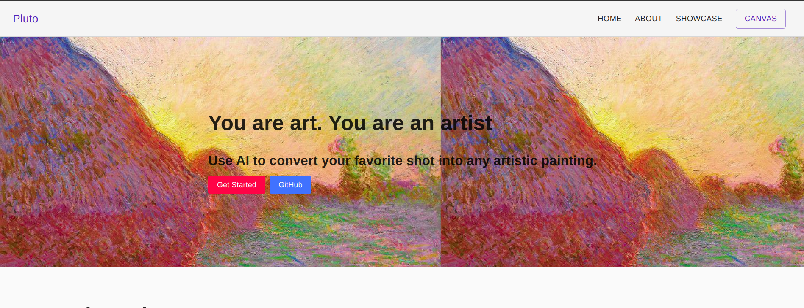
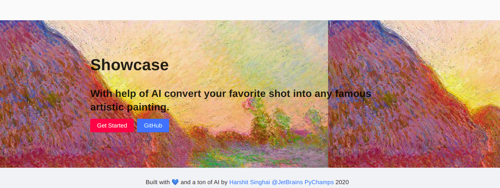
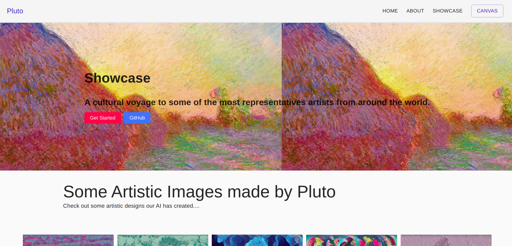
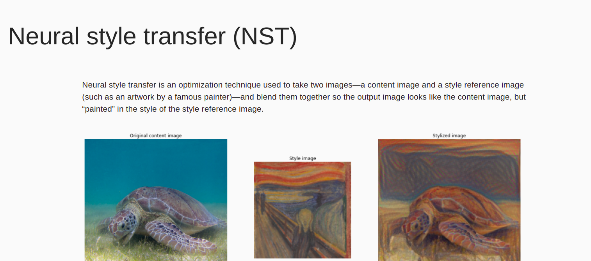

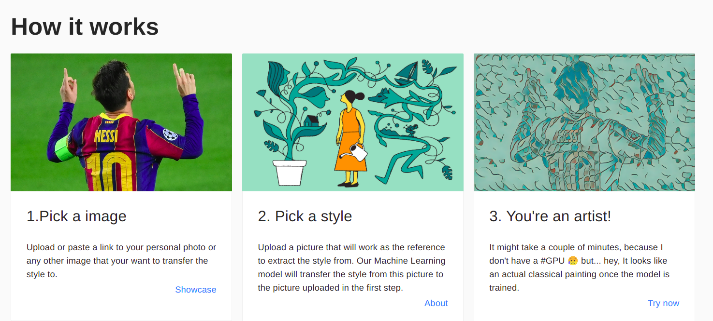
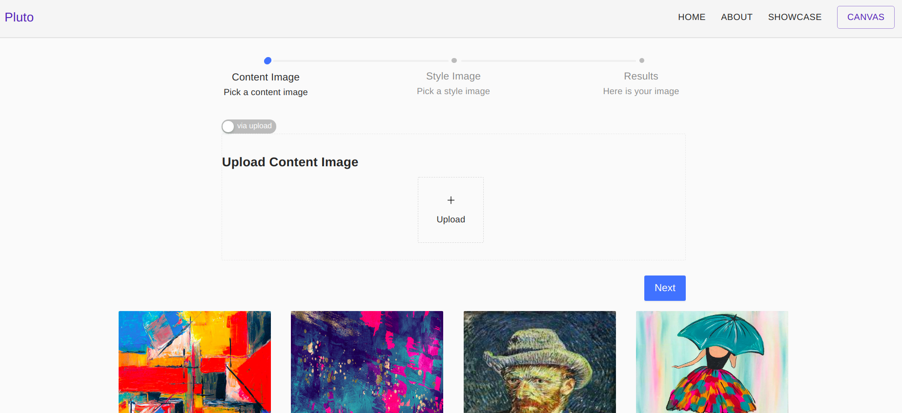
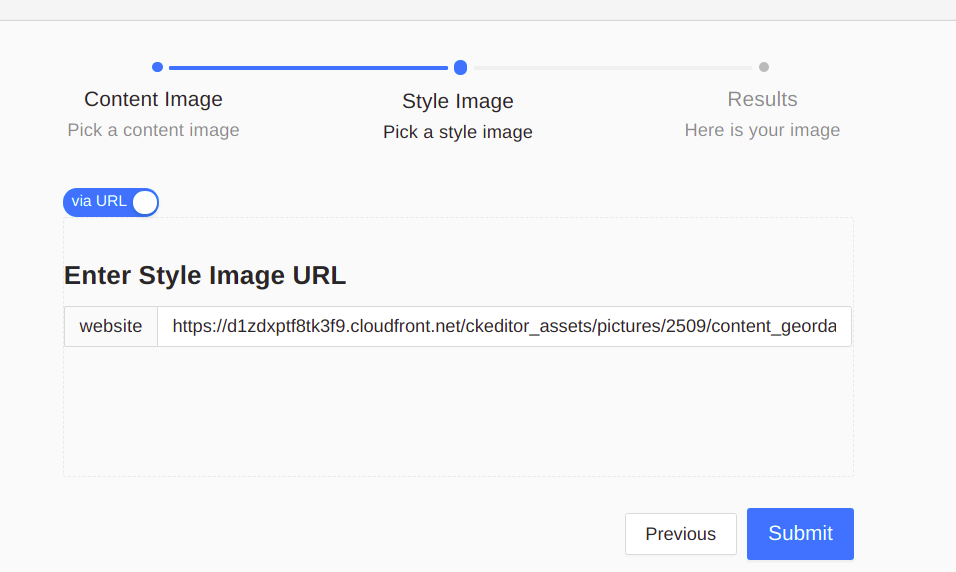
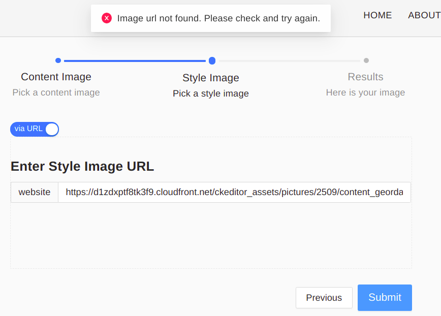
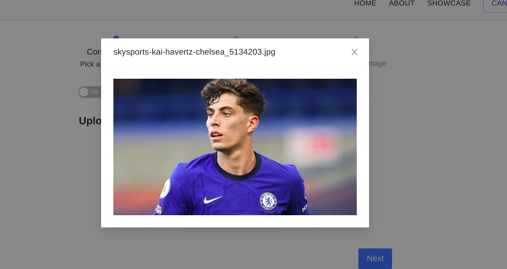

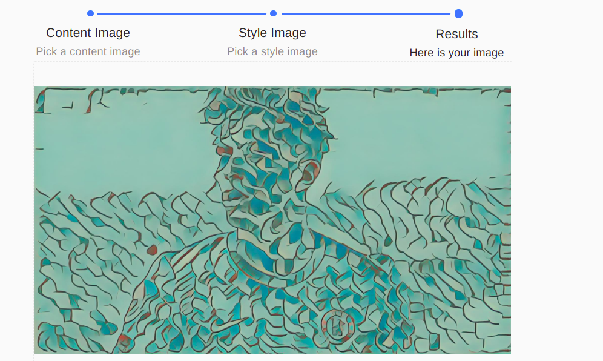
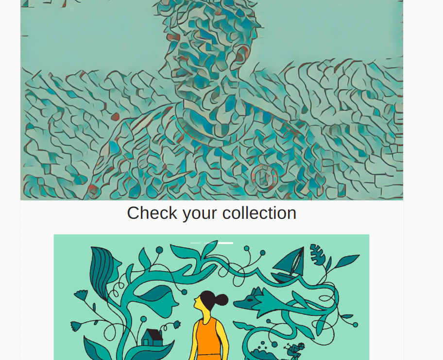
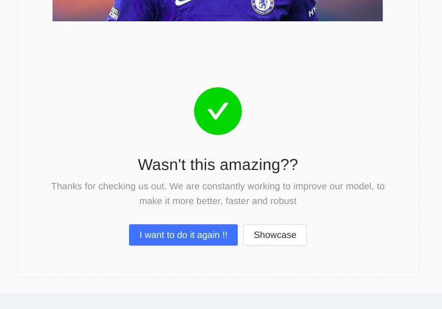
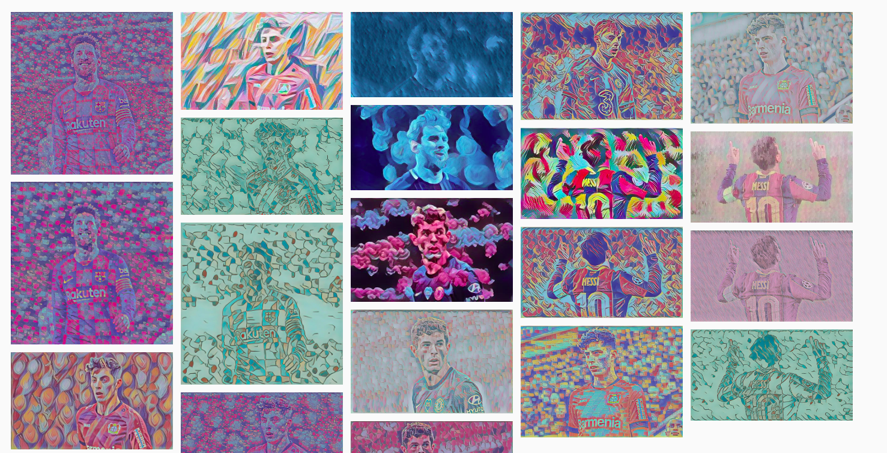

## Built with

   

| Langauge   | Framework                                                         | Component               |
| ---------- | ----------------------------------------------------------------- | ----------------------- |
| JavaScript | [React.js](https://reactjs.org/)                                  | Frontend                |
| Python     | [Flask](https://flask.palletsprojects.com/en/1.1.x/)              | Backend                 |
| Python     | [Firebase](https://duckduckgo.com/?t=canonical&q=Firebase&ia=web) | Database                |
| Python     | [TensorFlow](https://www.tensorflow.org/)                         | Aritifical Intelligence |

## Team

|                                                                                                                                                       Harshit Singhai                                                                                                                                                       |
| :-------------------------------------------------------------------------------------------------------------------------------------------------------------------------------------------------------------------------------------------------------------------------------------------------------------------------: |
| [](https://github.com/harshitsinghai77)<br />[🌍](https://fictionally-irrelevant.vercel.app/) [💻](https://github.com/harshitsinghai77) [🤝](https://www.linkedin.com/in/harshitsinghai/) |

## License

You can read the MIT License here
